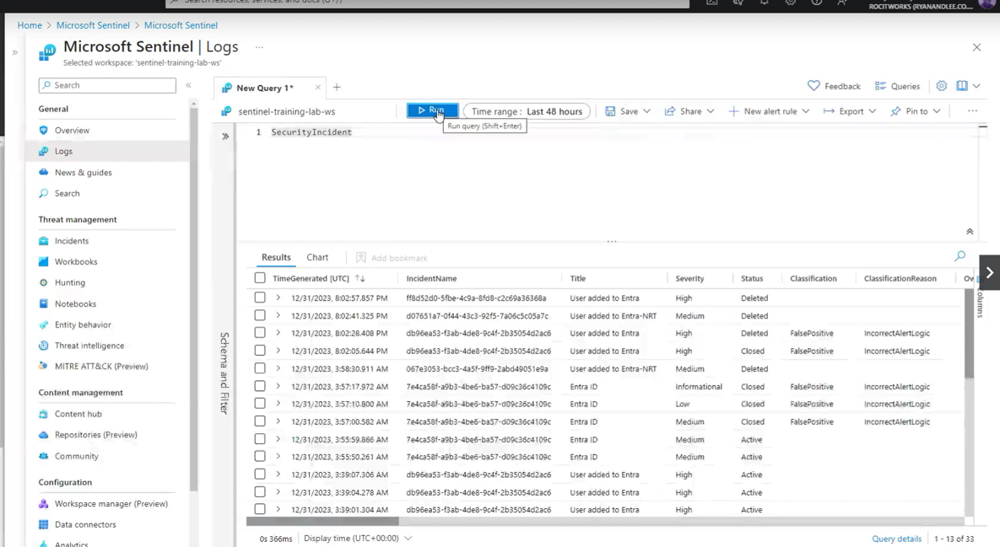
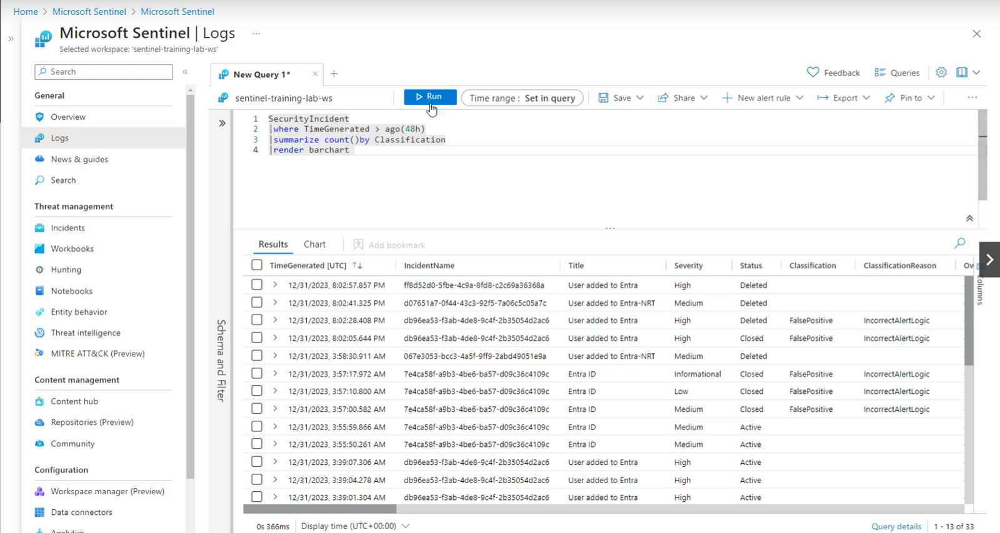

# Sentinel

First, deploy a watchlist, in this case for newly added users or deleted users. Other examples of watchlists could be for importing a list of users with Privileged access who could then be put on an allowlist to avoid alerts being created by them. Or, a watchlist for former employees could be created and then a blocklist used to prevent them from logging on to the network.

 

 

Next, create hunt queries for any New Users in Entra and deleted Users also.

 

 

 

 

 

 

An existing UEBA rule can be customised for your context.

  

 

  

 

  

 

  

 

Then a new query can be edited and then click run to execute it.

  

 

  

 

Finally, logs can be analysed.

 

 

